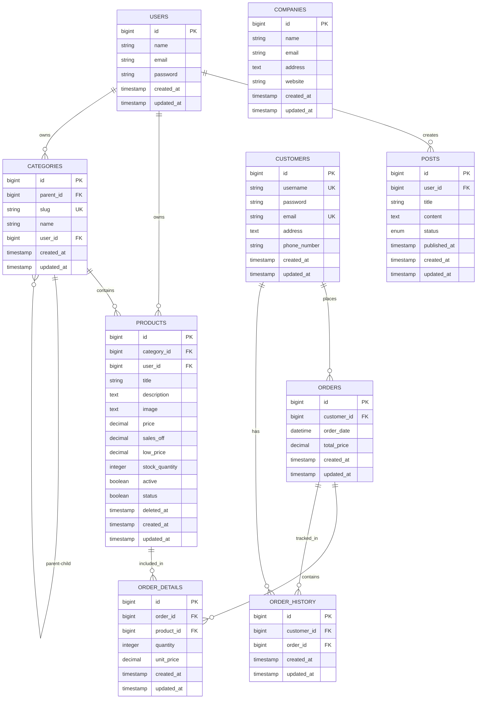

# Shop2024 - Full Stack E-commerce Application

A modern e-commerce platform built with **Laravel 10** backend API and **React 18** frontend, featuring secure SPA authentication using Laravel Sanctum, complete order management system, and comprehensive CRUD operations.

## 📋 Table of Contents

- [Overview](#overview)
- [Tech Stack](#tech-stack)
- [Features](#features)
- [Project Structure](#project-structure)
- [Database Schema & ERD](#database-schema--erd)
- [Business Logic Analysis](#business-logic-analysis)
- [Business Roles & Functionalities](#business-roles--functionalities)
- [Installation](#installation)
- [Configuration](#configuration)
- [Email Configuration](#email-configuration)
- [PDF Export Configuration](#pdf-export-configuration)
- [API Documentation](#api-documentation)
- [Frontend Setup](#frontend-setup)
- [Usage](#usage)
- [Security Features](#security-features)
- [Contributing](#contributing)
- [License](#license)

## 🚀 Overview

Shop2024 is a full-stack e-commerce application that demonstrates modern web development practices with secure authentication, responsive design, and scalable architecture. The application includes a complete order management system with customer management, product catalog, order processing, and order history tracking.

### Key Highlights

- **Secure Authentication**: Laravel Sanctum with CSRF protection
- **Modern Frontend**: React 18 with Vite for fast development
- **Responsive Design**: Tailwind CSS with Flowbite components
- **API-First Architecture**: RESTful API with proper validation
- **State Management**: React Context for authentication state
- **Order Management**: Complete e-commerce order processing system
- **Stock Management**: Automatic inventory tracking
- **Transaction Safety**: Database transactions for data integrity

## 🛠 Tech Stack

### Backend
- **Laravel 10** - PHP web framework
- **Laravel Sanctum** - API authentication
- **MySQL** - Database
- **Eloquent ORM** - Database abstraction
- **Form Requests** - Input validation
- **Database Transactions** - Data integrity
- **Laravel DomPDF** (barryvdh/laravel-dompdf) - PDF generation and export
- **Laravel Mail** - Email notification system

### Frontend
- **React 18** - JavaScript library
- **Vite** - Build tool and dev server
- **React Router DOM** - Client-side routing
- **Axios** - HTTP client
- **Tailwind CSS** - Utility-first CSS framework
- **Flowbite** - UI component library
- **SweetAlert2** - Beautiful alerts and notifications

## ✨ Features

### Authentication System
- User registration with validation
- Secure login with password hashing
- JWT token-based authentication
- CSRF protection
- Automatic token refresh
- Secure logout functionality

### E-commerce Core Features
- **Customer Management**: Complete CRUD operations for customers
- **Product Catalog**: Product management with categories and stock tracking
- **Order Management**: Complex order creation with automatic calculations
- **Order Details**: Detailed order tracking with product information
- **Order History**: Complete order history for customers
- **Stock Management**: Automatic stock updates on order creation/update/deletion
- **Category Management**: Hierarchical category system

### Export & Reporting Features
- **PDF Export**: Export customers and orders as PDF documents
  - Professional PDF formatting with company branding
  - Includes search filters and summary statistics
  - Automatic filename generation with timestamps
- **CSV Export**: Export customers and orders as CSV files
  - Comma-separated values for data analysis
  - Includes all relevant fields and relationships
  - Compatible with Excel and spreadsheet applications

### Email Notification System
- **Registration Emails**: Automatic welcome emails sent upon user registration
  - Professional HTML email templates
  - Includes account information and welcome message
  - Branded with company information
- **Order Confirmation Emails**: Automatic emails sent upon successful order creation
  - Detailed order information with items and pricing
  - Professional shipping confirmation template
  - Includes order summary and customer details

### User Management
- User profile management
- Protected routes
- Guest/authenticated layouts
- Session persistence

### UI/UX Features
- Responsive design
- Dark mode support
- Form validation with error handling
- Loading states
- Toast notifications
- Real-time calculations
- Search and filtering
- Pagination

## 📁 Project Structure

```
shop2024/
├── backend/                          # Laravel API
│   ├── app/
│   │   ├── Http/
│   │   │   ├── Controllers/
│   │   │   │   ├── Api/
│   │   │   │   │   ├── CompanyController.php
│   │   │   │   │   ├── CustomerController.php
│   │   │   │   │   ├── OrderController.php
│   │   │   │   │   ├── OrderDetailController.php
│   │   │   │   │   └── OrderHistoryController.php
│   │   │   │   ├── AuthController.php
│   │   │   │   ├── CategoryController.php
│   │   │   │   ├── PostController.php
│   │   │   │   └── ProductController.php
│   │   │   ├── Middleware/
│   │   │   ├── Requests/            # Form validation
│   │   │   │   ├── CustomerRequest.php
│   │   │   │   ├── OrderRequest.php
│   │   │   │   ├── OrderDetailRequest.php
│   │   │   │   └── OrderHistoryRequest.php
│   │   │   └── Resources/           # API resources
│   │   │       ├── CustomerResource.php
│   │   │       ├── OrderResource.php
│   │   │       ├── OrderDetailResource.php
│   │   │       └── OrderHistoryResource.php
│   │   ├── Mail/                     # Email classes
│   │   │   ├── RegisterEmail.php
│   │   │   └── OrderShipped.php
│   │   └── Models/
│   │       ├── User.php
│   │       ├── Customer.php
│   │       ├── Product.php
│   │       ├── Category.php
│   │       ├── Order.php
│   │       ├── OrderDetail.php
│   │       ├── OrderHistory.php
│   │       ├── Company.php
│   │       └── Post.php
│   ├── config/
│   │   └── mail.php                  # Email configuration
│   ├── resources/
│   │   └── views/
│   │       ├── mail/                 # Email templates
│   │       │   ├── users/
│   │       │   │   └── register.blade.php
│   │       │   └── orders/
│   │       │       └── shipped.blade.php
│   │       └── exports/              # PDF export templates
│   │           ├── customers-pdf.blade.php
│   │           └── orders-pdf.blade.php
│   ├── database/
│   │   ├── migrations/
│   │   │   ├── 2014_10_12_000000_create_users_table.php
│   │   │   ├── 2024_01_07_011744_create_products_table.php
│   │   │   ├── 2024_01_11_091423_create_categories_table.php
│   │   │   ├── 2025_10_05_093450_create_companies_table.php
│   │   │   ├── 2025_11_22_103159_add_category_id_and_stock_quantity_to_products_table.php
│   │   │   ├── 2025_11_22_103554_create_customers_table.php
│   │   │   ├── 2025_11_22_103603_create_orders_table.php
│   │   │   ├── 2025_11_22_103611_create_order_details_table.php
│   │   │   └── 2025_11_22_103620_create_order_history_table.php
│   │   └── seeders/
│   └── routes/
│       └── api.php                   # API routes
├── frontend/                         # React Application
│   ├── src/
│   │   ├── components/
│   │   │   ├── customer/            # Customer components
│   │   │   │   ├── list.component.jsx
│   │   │   │   ├── create.component.jsx
│   │   │   │   ├── edit.component.jsx
│   │   │   │   └── detail.component.jsx
│   │   │   ├── order/               # Order components
│   │   │   │   ├── list.component.jsx
│   │   │   │   ├── create.component.jsx
│   │   │   │   └── detail.component.jsx
│   │   │   ├── product/            # Product components
│   │   │   ├── category/           # Category components
│   │   │   ├── company/            # Company components
│   │   │   ├── post/               # Post components
│   │   │   ├── ProtectedLayout.jsx
│   │   │   └── GuestLayout.jsx
│   │   ├── contexts/
│   │   │   └── AuthContext.jsx      # Authentication context
│   │   ├── pages/                  # Page components
│   │   │   ├── Customer.jsx
│   │   │   ├── Order.jsx
│   │   │   ├── Product.jsx
│   │   │   ├── Category.jsx
│   │   │   ├── Company.jsx
│   │   │   ├── Post.jsx
│   │   │   ├── Login.jsx
│   │   │   ├── Register.jsx
│   │   │   └── Profile.jsx
│   │   ├── services/               # API service layer
│   │   │   ├── customerService.js
│   │   │   ├── orderService.js
│   │   │   └── postService.js
│   │   ├── router.jsx             # React Router configuration
│   │   └── axios.js               # Axios configuration
│   └── public/
└── README.md
```

## 🗄️ Database Schema & ERD

### Entity-Relationship Diagram



### Database Tables

#### Core E-commerce Tables

1. **customers**
   - Stores customer information
   - Password is automatically hashed
   - Unique constraints on username and email

2. **products**
   - Product catalog with pricing
   - Stock quantity tracking
   - Category association
   - Soft deletes enabled

3. **categories**
   - Hierarchical category structure (parent-child)
   - User ownership for multi-tenant support

4. **orders**
   - Customer orders with total price
   - Order date tracking
   - Cascade delete with customer

5. **order_details**
   - Individual items in an order
   - Quantity and unit price
   - Links orders to products

6. **order_history**
   - Historical tracking of orders
   - Links customers to their order history

#### Supporting Tables

7. **users** - System administrators/users
8. **companies** - Company management
9. **posts** - Blog/content management

## 💼 Business Logic Analysis

### Order Management Flow

#### 1. Order Creation Process

```
Customer Selection → Product Selection → Quantity Input → 
Price Calculation → Stock Validation → Order Creation → 
Stock Deduction → Order History Entry → Email Notification
```

**Key Business Rules:**
- Orders must have at least one product
- Total price is automatically calculated from order details
- Stock quantity is decremented when order is created
- Order history is automatically created
- Email notification is automatically sent to customer upon order creation
- All operations are wrapped in database transactions

#### 2. Stock Management Logic

**On Order Creation:**
- Validate stock availability
- Decrement stock quantity for each product
- Prevent negative stock values

**On Order Update:**
- Restore old stock quantities
- Apply new stock deductions
- Maintain data consistency

**On Order Deletion:**
- Restore all stock quantities
- Maintain inventory accuracy

#### 3. Order Detail Management

**Automatic Calculations:**
- Subtotal = quantity × unit_price
- Order total = sum of all order detail subtotals
- Real-time price updates

**Business Constraints:**
- Minimum quantity: 1
- Unit price must be positive
- Product must exist and be active

#### 4. Customer Management

**Password Security:**
- Automatic password hashing using bcrypt
- Password hidden in API responses
- Optional password update (only if provided)

**Data Validation:**
- Unique username and email
- Email format validation
- Minimum password length: 6 characters

#### 5. Product-Category Relationship

**Hierarchical Categories:**
- Self-referencing parent-child relationship
- Products belong to a category
- Categories can have subcategories
- Cascade delete protection (set null on category delete)

#### 6. Transaction Safety

**Database Transactions:**
- Order creation: Atomic operation
- Order update: Rollback on failure
- Stock updates: Consistent state
- Error handling: Automatic rollback

### API Business Logic

#### Order Controller Logic

1. **Store Method:**
   - Validates customer and order details
   - Creates order in transaction
   - Creates order details
   - Updates product stock
   - Creates order history entry
   - Sends order confirmation email to customer
   - Returns complete order with relationships

2. **Update Method:**
   - Restores old stock quantities
   - Updates order information
   - Recreates order details
   - Updates new stock quantities
   - Maintains data integrity

3. **Delete Method:**
   - Restores all stock quantities
   - Cascades to order details
   - Maintains inventory accuracy

#### Order Detail Controller Logic

1. **Stock Synchronization:**
   - Updates product stock on create/update/delete
   - Updates order total price automatically
   - Maintains consistency

2. **Price Calculations:**
   - Automatic subtotal calculation
   - Order total recalculation
   - Real-time updates

### Frontend Business Logic

#### Order Creation Component

1. **Dynamic Product Selection:**
   - Loads available products
   - Shows stock quantities
   - Auto-fills unit prices
   - Real-time total calculation

2. **Form Validation:**
   - Customer selection required
   - At least one product required
   - Quantity validation
   - Price validation

3. **User Experience:**
   - Debounced search
   - Loading states
   - Error handling
   - Success notifications

#### Customer List Component

1. **Optimized Data Fetching:**
   - Pagination support
   - Search functionality
   - Relationship loading (optional)
   - Debounced search input

2. **Performance:**
   - Fixed infinite loop issues
   - Proper dependency management
   - Efficient re-renders

#### Export Functionality

1. **PDF Export:**
   - Uses Laravel DomPDF library
   - Professional Blade templates for formatting
   - Automatic filename generation
   - Supports search and filtering
   - Includes summary statistics

2. **CSV Export:**
   - Stream-based CSV generation
   - Efficient memory usage for large datasets
   - Proper CSV formatting with headers
   - Automatic filename generation

3. **Frontend Integration:**
   - Service layer methods for export
   - Automatic file download handling
   - Blob URL management
   - Error handling and user feedback

## 🚀 Installation

### Prerequisites

- PHP 8.1 or higher
- Composer
- Node.js 16+ and npm
- MySQL 8.0 or higher
- Git

### Backend Setup

1. **Clone the repository**
   ```bash
   git clone <repository-url>
   cd shop2024/backend
   ```

2. **Install PHP dependencies**
   ```bash
   composer install
   ```

3. **Environment configuration**
   ```bash
   cp .env.example .env
   php artisan key:generate
   ```

4. **Database setup**
   ```bash
   # Update .env with your database credentials
   php artisan migrate
   php artisan db:seed
   ```

5. **Start the server**
   ```bash
   php artisan serve
   ```

### Frontend Setup

1. **Navigate to frontend directory**
   ```bash
   cd ../frontend
   ```

2. **Install dependencies**
   ```bash
   npm install
   ```

3. **Start development server**
   ```bash
   npm run dev
   ```

## ⚙️ Configuration

### Backend Environment Variables

```env
# Application
APP_NAME=Shop2024
APP_ENV=local
APP_DEBUG=true
APP_URL=http://localhost:8000

# Database
DB_CONNECTION=mysql
DB_HOST=127.0.0.1
DB_PORT=3306
DB_DATABASE=shop2024
DB_USERNAME=root
DB_PASSWORD=

# Sanctum Configuration
FRONTEND_URL=http://localhost:3000
SESSION_DOMAIN=localhost
SANCTUM_STATEFUL_DOMAINS=localhost:3000

# Session
SESSION_DRIVER=cookie
SESSION_LIFETIME=120

# Mail Configuration
MAIL_MAILER=smtp
MAIL_HOST=smtp.mailgun.org
MAIL_PORT=587
MAIL_USERNAME=your-email@example.com
MAIL_PASSWORD=your-password
MAIL_ENCRYPTION=tls
MAIL_FROM_ADDRESS=shop24@gmail.com
MAIL_FROM_NAME="Henry & Janes Shop"
```

### Frontend Configuration

Update `src/axios.js` with your backend URL:

```javascript
const axios = Axios.create({
    baseURL: "http://localhost:8000/api",
    withCredentials: true,
    headers: {
        "Content-Type": "application/json",
        "Accept": "application/json",
    },
});
```

## 📚 API Documentation

### Authentication Endpoints

#### Register User
```http
POST /api/register
Content-Type: application/json

{
    "name": "John Doe",
    "email": "john@example.com",
    "password": "password123",
    "password_confirmation": "password123"
}
```

#### Login User
```http
POST /api/login
Content-Type: application/json

{
    "email": "john@example.com",
    "password": "password123"
}
```

### Customer Endpoints

#### List Customers
```http
GET /api/customers?page=1&per_page=15&search=john
```

#### Get Customer
```http
GET /api/customers/{id}?with=orders,orderHistory
```

#### Create Customer
```http
POST /api/customers
Content-Type: application/json

{
    "username": "johndoe",
    "email": "john@example.com",
    "password": "password123",
    "phone_number": "+1234567890",
    "address": "123 Main St"
}
```

#### Update Customer
```http
PUT /api/customers/{id}
Content-Type: application/json

{
    "username": "johndoe",
    "email": "john@example.com",
    "password": "newpassword",  // Optional
    "phone_number": "+1234567890",
    "address": "123 Main St"
}
```

#### Delete Customer
```http
DELETE /api/customers/{id}
```

#### Export Customers as CSV
```http
GET /api/customers/export/csv?search=john
```

**Query Parameters:**
- `search` (optional): Search by username, email, or phone number

**Response:** CSV file download with filename `customers_YYYY-MM-DD_HHMMSS.csv`

#### Export Customers as PDF
```http
GET /api/customers/export/pdf?search=john
```

**Query Parameters:**
- `search` (optional): Search by username, email, or phone number

**Response:** PDF file download with filename `customers_YYYY-MM-DD_HHMMSS.pdf`

**PDF Includes:**
- Professional header with title and generation date
- Complete customer table with all fields
- Summary statistics (total records)
- Formatted for printing

### Order Endpoints

#### List Orders
  ```http
GET /api/orders?page=1&per_page=15&customer_id=1&with=customer,orderDetails
  ```

#### Get Order
  ```http
GET /api/orders/{id}?with=customer,orderDetails,orderDetails.product
  ```

#### Create Order
  ```http
POST /api/orders
  Content-Type: application/json

  {
    "customer_id": 1,
    "order_date": "2024-11-22 10:00:00",
    "total_price": 150.00,
    "order_details": [
        {
            "product_id": 1,
            "quantity": 2,
            "unit_price": 50.00
        },
        {
            "product_id": 2,
            "quantity": 1,
            "unit_price": 50.00
        }
    ]
}
```

**Note:** Stock is automatically decremented, order history is created automatically.

#### Update Order
  ```http
PUT /api/orders/{id}
  Content-Type: application/json

  {
    "customer_id": 1,
    "order_date": "2024-11-22 10:00:00",
    "total_price": 200.00,
    "order_details": [...]
}
```

**Note:** Old stock is restored, new stock is decremented.

#### Delete Order
```http
DELETE /api/orders/{id}
```

**Note:** All stock quantities are restored.

#### Export Orders as CSV
```http
GET /api/orders/export/csv?search=john&customer_id=1
```

**Query Parameters:**
- `search` (optional): Search by customer username or email
- `customer_id` (optional): Filter by specific customer

**Response:** CSV file download with filename `orders_YYYY-MM-DD_HHMMSS.csv`

**CSV Includes:**
- Order ID, Customer ID, Customer Username, Customer Email
- Order Date, Total Price, Created At, Updated At

#### Export Orders as PDF
```http
GET /api/orders/export/pdf?search=john&customer_id=1
```

**Query Parameters:**
- `search` (optional): Search by customer username or email
- `customer_id` (optional): Filter by specific customer

**Response:** PDF file download with filename `orders_YYYY-MM-DD_HHMMSS.pdf`

**PDF Includes:**
- Professional header with title and generation date
- Complete order table with customer information
- Order details with product information
- Summary statistics (total orders, total value)
- Formatted for printing

### Order Detail Endpoints

#### List Order Details
  ```http
GET /api/order-details?order_id=1&product_id=1
```

#### Create Order Detail
```http
POST /api/order-details
Content-Type: application/json

{
    "order_id": 1,
    "product_id": 1,
    "quantity": 2,
    "unit_price": 50.00
}
```

**Note:** Product stock is decremented, order total is updated.

### Product Endpoints

#### List Products
```http
GET /api/products
```

#### Get Product
```http
GET /api/products/{id}
```

#### Create Product
```http
POST /api/products
Content-Type: application/json

{
    "title": "Product Name",
    "description": "Product description",
    "price": 99.99,
    "category_id": 1,
    "stock_quantity": 100,
    "image": "path/to/image.jpg"
}
```

### Category Endpoints

#### List Categories
```http
GET /api/categories
```

#### Get Category
```http
GET /api/categories/{id}
```

### Email Notification Endpoints

#### Registration Email
When a user registers via `POST /api/register`, an automatic welcome email is sent to the registered user's email address.

**Email Content:**
- Welcome message from "Henry & Janes Shop"
- User account information (name, email, creation date)
- Professional HTML template with branding

**Email Template:** `resources/views/mail/users/register.blade.php`

#### Order Confirmation Email
When an order is created via `POST /api/orders`, an automatic order confirmation email is sent to the customer's email address.

**Email Content:**
- Order confirmation message
- Order details (order number, date, shipping address)
- Complete order items table with quantities and prices
- Total order amount
- Professional HTML template with branding

**Email Template:** `resources/views/mail/orders/shipped.blade.php`

**Note:** Email sending is handled automatically by the system. No separate API endpoint is required.

## 🎨 Frontend Setup

### Component Structure

```
src/
├── components/
│   ├── customer/          # Customer CRUD components
│   ├── order/            # Order management components
│   ├── product/          # Product components
│   ├── category/         # Category components
│   ├── company/          # Company components
│   ├── post/             # Post components
│   ├── ProtectedLayout.jsx
│   └── GuestLayout.jsx
├── contexts/
│   └── AuthContext.jsx
├── pages/
│   ├── Customer.jsx
│   ├── Order.jsx
│   ├── Product.jsx
│   └── ...
├── services/
│   ├── customerService.js
│   ├── orderService.js
│   └── postService.js
└── router.jsx
```

### Key Features

- **Service Layer**: Centralized API calls
- **Context-based State Management**: Centralized authentication state
- **Protected Routes**: Automatic redirection based on auth status
- **Form Validation**: Real-time validation with error display
- **Responsive Design**: Mobile-first approach with Tailwind CSS
- **Debounced Search**: Optimized search functionality
- **Pagination**: Efficient data loading

## 📧 Email Configuration

### Laravel Mail Setup

The application uses Laravel's built-in mail system with SMTP support. Configure your email settings in the `.env` file:

```env
MAIL_MAILER=smtp
MAIL_HOST=smtp.mailgun.org
MAIL_PORT=587
MAIL_USERNAME=your-email@example.com
MAIL_PASSWORD=your-password
MAIL_ENCRYPTION=tls
MAIL_FROM_ADDRESS=shop24@gmail.com
MAIL_FROM_NAME="Henry & Janes Shop"
```

### Supported Mail Drivers

- **SMTP**: Standard SMTP server (recommended for production)
- **Mailgun**: Mailgun service
- **SES**: Amazon SES
- **Postmark**: Postmark service
- **Sendmail**: Local sendmail
- **Log**: Log emails to file (for development/testing)

### Email Templates

Email templates are located in `backend/resources/views/mail/`:

- **Registration Email**: `mail/users/register.blade.php`
  - Sent when a new user registers
  - Includes welcome message and account details

- **Order Confirmation Email**: `mail/orders/shipped.blade.php`
  - Sent when an order is successfully created
  - Includes order details, items, and total amount

### Mail Classes

Email classes are located in `backend/app/Mail/`:

- **RegisterEmail**: Handles registration email sending
- **OrderShipped**: Handles order confirmation email sending

## 📄 PDF Export Configuration

### Laravel DomPDF Setup

The application uses `barryvdh/laravel-dompdf` for PDF generation. The package is already included in `composer.json`.

### PDF Templates

PDF export templates are located in `backend/resources/views/exports/`:

- **Customers PDF**: `exports/customers-pdf.blade.php`
  - Professional table layout
  - Includes all customer fields
  - Summary statistics

- **Orders PDF**: `exports/orders-pdf.blade.php`
  - Detailed order information
  - Customer and product details
  - Order items with pricing
  - Summary statistics

### PDF Generation

PDFs are generated using Blade templates and the DomPDF facade:

```php
use Barryvdh\DomPDF\Facade\Pdf;

$pdf = Pdf::loadView('exports.customers-pdf', $data);
return $pdf->download('filename.pdf');
```

## 💼 Business Roles & Functionalities

### System Roles

#### 1. **Administrator/User Role**
- **Authentication**: Secure login and registration
- **User Management**: Profile management and session handling
- **Content Management**: 
  - Create, update, and delete posts
  - Manage product catalog
  - Manage categories (hierarchical structure)
  - Manage company information

#### 2. **Customer Role**
- **Account Management**: Customer profile with username, email, address, phone
- **Order Management**: 
  - Place orders with multiple products
  - View order history
  - Track order details
- **Email Notifications**: Receive automatic emails for order confirmations

### Business Functionalities

#### 1. **E-commerce Operations**
- **Product Catalog Management**
  - Product CRUD operations
  - Category-based organization
  - Stock quantity tracking
  - Price management with sales and discounts
  - Product images and descriptions

- **Order Processing**
  - Multi-product order creation
  - Automatic price calculations
  - Stock inventory management
  - Order history tracking
  - Transaction safety with database rollback

- **Customer Management**
  - Customer registration and authentication
  - Profile management
  - Order history tracking
  - Secure password handling

#### 2. **Reporting & Analytics**
- **Data Export**
  - PDF export for customers and orders
  - CSV export for data analysis
  - Search and filter capabilities
  - Summary statistics

- **Order Analytics**
  - Order tracking by customer
  - Order history analysis
  - Revenue calculations
  - Product sales tracking

#### 3. **Communication & Notifications**
- **Email System**
  - Welcome emails for new registrations
  - Order confirmation emails
  - Professional HTML email templates
  - Branded email design

#### 4. **Content Management**
- **Blog/Post Management**
  - Create and manage blog posts
  - Post status management (draft, published, archived)
  - User-specific post ownership
  - Post statistics

- **Category Management**
  - Hierarchical category structure
  - Parent-child relationships
  - Category-based product organization

#### 5. **Security & Data Integrity**
- **Authentication Security**
  - Laravel Sanctum token-based authentication
  - CSRF protection
  - Secure password hashing (bcrypt)
  - Session management

- **Data Protection**
  - SQL injection prevention (Eloquent ORM)
  - XSS protection
  - Input validation
  - Database transactions for data consistency

#### 6. **User Experience Features**
- **Frontend Features**
  - Responsive design (mobile-first)
  - Dark mode support
  - Real-time form validation
  - Loading states and error handling
  - Toast notifications
  - Search and pagination
  - Export functionality with file downloads

### Business Workflows

#### Customer Registration Workflow
```
User Registration → Email Validation → Account Creation → 
Password Hashing → Welcome Email → Authentication Token → 
Session Creation
```

#### Order Processing Workflow
```
Customer Selection → Product Selection → Quantity Input → 
Price Calculation → Stock Validation → Order Creation → 
Stock Deduction → Order History Entry → Email Notification → 
Order Confirmation
```

#### Export Workflow
```
User Request → Search/Filter Application → Data Retrieval → 
Template Rendering (PDF) or CSV Generation → File Download → 
User Notification
```

## 🔐 Security Features

### Laravel Sanctum Security

- **CSRF Protection**: Automatic CSRF token generation and validation
- **Cookie-based Authentication**: Secure HTTP-only cookies
- **Token Management**: Automatic token creation and deletion
- **Session Security**: Configurable session lifetime and domain restrictions

### Frontend Security

- **Secure HTTP Client**: Axios with credentials support
- **Input Validation**: Client and server-side validation
- **Protected Routes**: Route guards for authenticated users
- **Password Hashing**: Automatic password hashing on backend

### Data Security

- **Password Hashing**: bcrypt with automatic hashing
- **SQL Injection Protection**: Eloquent ORM parameter binding
- **XSS Protection**: Input sanitization
- **Transaction Safety**: Database transactions for data integrity

## 🚀 Usage

### Development Workflow

1. **Start both servers**
   ```bash
   # Terminal 1 - Backend
   cd backend && php artisan serve
   
   # Terminal 2 - Frontend
   cd frontend && npm run dev
   ```

2. **Access the application**
   - Frontend: http://localhost:3000
   - Backend API: http://localhost:8000

3. **Test the application**
   - Register/Login
   - Create customers
   - Create products
   - Create orders with multiple products
   - View order details
   - Check stock updates

### Production Deployment

1. **Backend deployment**
   ```bash
   composer install --optimize-autoloader --no-dev
   php artisan config:cache
   php artisan route:cache
   php artisan view:cache
   ```

2. **Frontend build**
   ```bash
   npm run build
   ```

## 🧪 Testing

### Backend Testing
```bash
cd backend
php artisan test
```

### Frontend Testing
```bash
cd frontend
npm test
```

## 📝 Contributing

1. Fork the repository
2. Create a feature branch (`git checkout -b feature/amazing-feature`)
3. Commit your changes (`git commit -m 'Add amazing feature'`)
4. Push to the branch (`git push origin feature/amazing-feature`)
5. Open a Pull Request

### Code Style

- Follow PSR-12 for PHP code
- Use ESLint and Prettier for JavaScript/React code
- Write meaningful commit messages
- Add tests for new features

## 📄 License

This project is licensed under the MIT License - see the [LICENSE](LICENSE) file for details.

## 🤝 Support

For support and questions:

- **Email**: nguyenvandat170296@gmail.com
- **Documentation**: [Project Documentation](https://docs.google.com/document/d/19myzJ_ZzX-ajytrTG5V67BFwRJ5dZLQgkxXqyCe1BrM/edit?usp=sharing)
- **Issues**: [GitHub Issues](https://github.com/your-repo/shop2024/issues)

## 🙏 Acknowledgments

- Laravel team for the amazing framework
- React team for the powerful frontend library
- Tailwind CSS for the utility-first CSS framework
- Flowbite for the beautiful UI components

---

**Built with ❤️ by Henry** 
key business : https://chatgpt.com/share/6921ab52-ee98-800d-a110-2cb56985434e